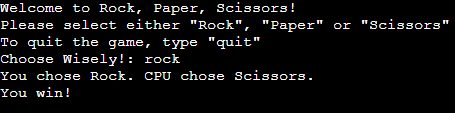

# Rock Paper Scissors
For this project I decided to create a Rock, Paper, Scissors game within python. It runs within a provided, interactive console. I feel it represents the versitility of python and just how useful it can be. A live version of the site can be found [here](https://sean-rock-paper-scissors-305074a0ba45.herokuapp.com/)

### How it works

It asks the user to pick Rock, Paper or Scissors. Once the user has made their move, a computer generated user will randomly choose one of the three possible answers. The user will then be informed if they have won, lost or if the game is a draw. The game will repeat until the user types "quit". The programme also has built in error checking to ensure that the user inputs valid data

### Testing
The programme was tested in the following ways:
- Passing it throught a PEP8 linter and passing without any major issues
- Giving invalid inputs and ensuring the errors are picked up
- Tested both in a python terminal and on Heroku

### Depoloyment

- Steps for deployment
    - Create a Heroku app
    - Setup two _Config Var_ elemnts. One called CREDS with the contents of the creds.json file
    - The second called PORT and set to 8000
    - Link the Heroku app to my GitHub repository
    - Deploy the app [here](https://sean-rock-paper-scissors-305074a0ba45.herokuapp.com/)